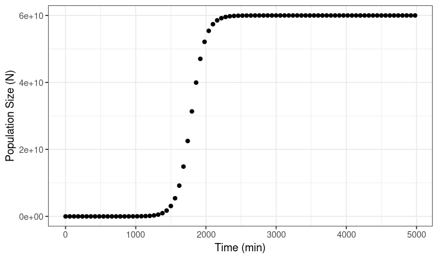
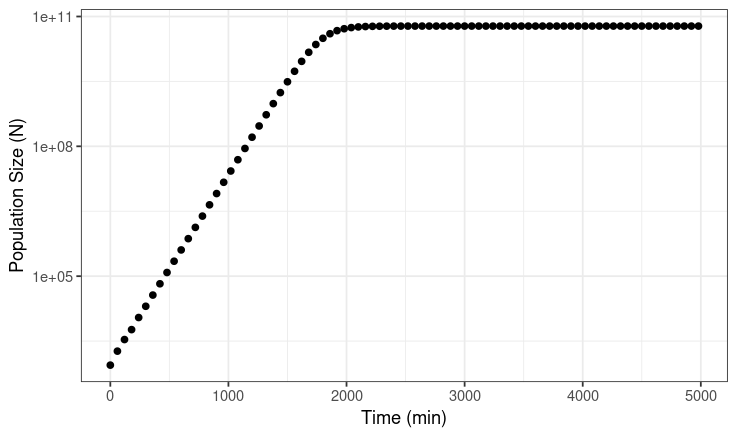
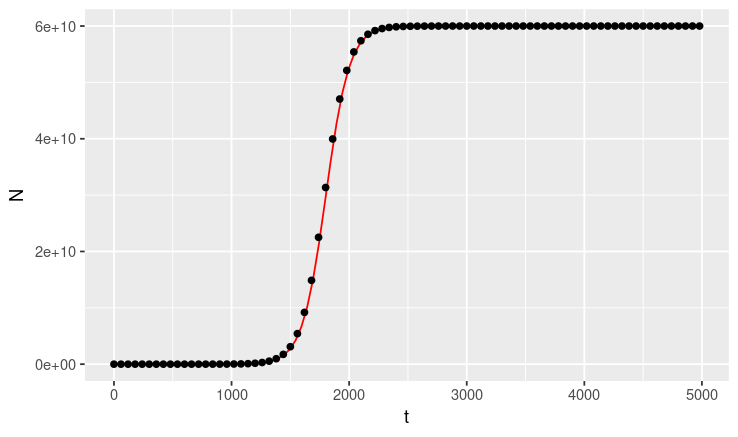
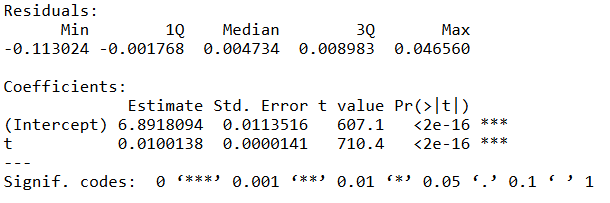
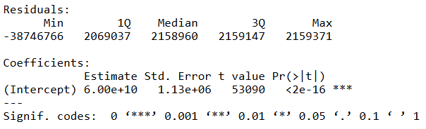
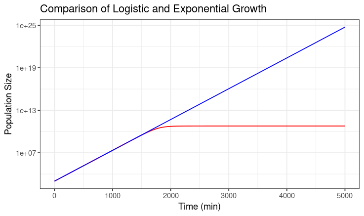

# Logistic Growth

## Question one

### Section one: Plotting Data

plot_data.R

The code below plots data from the experiment.csv file, which contains results from a single simulated experiment of Escherichia coli growth. Figure one displays bacterial population size (number of bacteria, N) and Time (t, in minutes), on the Y and X axes, respectively.

The first graph exhibits a sigmoidal growth curve. The population size is small and has negligible growth until approximately t = 1500, at which bacteria display a phase of exponential growth before plateauing at approximately t = 2400, when the bacterial population reaches carrying capacity (k). This logistic growth curve is common for simulations of bacterial growth and can be divided into the lag phase, where population size is small and growth is negligible, the exponential phase, where the population is large enough to substantially exploit available recourses (as seen in rapid increase in population size), and finally followed by the stationary phase, whethere the population size meets carrying capacity and stabilises at this point, determined by the amount of nutrients available and available space for replication in the growth media solution.

figure1: sigmoidal growth curve showing population size (N) on the y-axis and time (t) on the x-axis on a linear scale:



The second graph is a semi-log plot, which maps the logarithm of N values over linear time, with a logarithmic-transformed Y-axis (log(N)), and linear X-axis (Time (min)) The Y axis is converted using the log() function in R, which converts N values by the natural logarith, ln(). The semi-log plot shows a positive linear relationship between ln(N) and t from t = (0-2000), before plateuing to a constant population size as t tends towards infinity. When analysing the semi-log plot in context of bacterial growth phases, the linear function in the time interval 0 <t <2000 represents the exponential phase, and the constant growth rate seen from 2000\<t is the stationary phase.

figure2: Semi-log plot of the logistic growth data from the experiment.csv data:



The code below describes how the linear-scale and semi-log growth curves were produced:

```{r}
# installing and loading ggplot2 package into the library

install.packages("ggplot2") 
library(ggplot2)

# reading in experiment file in .csv format

growth_data <- read.csv("experiment.csv") 


## Plotting time against population size

ggplot(aes(t,N), data = growth_data) + # Plotting time (t) and population size (N) on the x and y axes, respectively
  
  geom_point() + # Plotting individual data points
  
  xlab("Time (min)") + # adding x axis label
  
  ylab("Population Size (N)") + # adding y axis label
  
  theme_bw() # creating a black and white theme  

## Plotting the same data on a log scale 

ggplot(aes(t,N), data = growth_data) +
  
  geom_point() +
  
  xlab("Time (min)") +
  
  ylab("Population Size (N)") +
  
  scale_y_continuous(trans='log10') + 
 
  theme_bw()

```

### Section Two: Fitting Linear Models

fit_linear_model.R

The script, fit_linear_model.R, produces two distinct linear models based on specified time intervals for the semi-log data, using the dplyr package. The models plot log_N and t as the response and explanatory variables, respectively. The filter() functiontion is used to separate the data by given values of large and small values of t. The script uses the lm() function to produce two linear models, model1 and model2, distinguished by the specified intervals of t for each model. Model1 the growth curve when t is small (t \< 1400), and model2 when t is large (t\>2500). These linear models approximate the linea formulue for the exponential and stationary growth stages described above (model 1 and 2, respectively). For each model, the summary() function is run to display the slope and intercept estimates.

The below code explains how the data was filtered to produce subsets and create the linear models:

```{r}
## Script to estimate the model parameters using a linear approximation

# installing and loading dplyr package into the library

install.packages("dplyr")
library(dplyr)

# reading in the experiment.csv file and allocating it as the object growth_data

growth_data <- read.csv("experiment.csv")

## Case 1. Exponential Growth: K >> N0, t is small

# t is small - therefore looking at data points where t < 1400 (prior to start of exponential growth curve)
# using N_log (log(N)) in place of N

data_subset1 <- growth_data %>% filter(t<1400) %>% mutate(N_log = log(N))

# creating a linear model with response variable log(N) and explanatory variable t, sing data_subset1 so t<1400

model1 <- lm(N_log ~ t, data_subset1)
summary(model1) # used to obtain the parameter estimates for the slopes and intercepts of the linear model

## Case 2. Stationary phase: N(t) = K

# creating a new object, but now with high values of t such that N is at carrying capacity (k)
# not using log(N)

data_subset2 <- growth_data %>% filter(t>2500)

# N is set to 1 as t is large and N is modeled as a constant (representing progression towards carrying capacity)
model2 <- lm(N ~ 1, data_subset2)
summary(model2)
```

### Section 3: Plotting and Modelling the Data

plot_data_and_model.R

The final script, plot_data_and_model.R, codes the function 'logistic_fun'. Specific parameters for the logistic growth function N0, r and K have been obtained from the linear approximation in section 2. The function superimposes the parameters onto growth data from the experiment.csv file to compare the parameters calculated by the linear model to the observed growth rates in teh experimental simulation. This allows us to visually compare if the model predictions match the simulated data in experiment.csv. The model predictions (red line) show a strong match to the black data points, suggesting the simulated _Escherichia coli_ population follows a logistic growth pattern.

Figure3: Logistic function with parameters specified from the previous linear model plotted over experiment.csv data points



The code below describes how the functions were generated:

```{r}
## Script to plot data and model

# reading in the experiment.csv file and allocating it as the object growth_data

growth_data <- read.csv("experiment.csv")

# creating a function: inputting a specific t value will output corresponding N value using specified values of K and r

logistic_fun <- function(t) {
  
  N <- (N0*K*exp(r*t))/(K-N0+N0*exp(r*t))
  
  return(N)
  
}

# defining function parameters
N0 <- 879 #obtained from experiment.csv data at time t=0
  
r <- 0.0100086 # obtained from model 1 summary output, presents the coefficient of t
### Results from linear model  
K <- 6.00e+10 # obtained form model 2 summary output, presents the intercept 

# creating a graph using the logistic model
ggplot(aes(t,N), data = growth_data) +
  
  geom_function(fun=logistic_fun, colour="red") +
  
  geom_point()

  #scale_y_continuous(trans='log10')
```

# Results

Using estimates of N0 and r to calculate N at t = 4980, assuming exponential population growth. Compare to predicted population size under a model of logistic growth

### Results from linear model1: t is small (t\<1400)

{width="382"}

In the first model, the intercept estimates bacterial population size at t=0: *N0*

linear model formula is:

*ln*(*N*) = *ln*(*N0*) + *rt*

when *K* \>\> *N0* and *t* is small

The coefficients column gives the parameters for the linear model formula: *y = b + mx*

The intercept (ln(*N0*)) = 6.8918094

*N0* = *e*\^6.918094 = 984.1806

*N0* = 984

The coefficient, *t*, estimates the growth rate, *r* = 0.0100138

### Results from linear model2: t is large (t\>2500)

{width="410"}

In the second model, the intercept estimates carrying capacity (K)

The intercept estimate is 6 x 10^10^, therefore this is our estimate for carrying capacity

We can then input these values in the linear model to obtain an estimate for growth rate r.

Therefore, from my analysis, the estimates for population size (N0), growth rate (r), and carrying capacity (K), are:

*N0* = 984

*r* = 0.01

K = 6 × 10^10^

### Question 2: calculate the population size at t = 4980 min, assuming that the population grows exponentially. How does it compare to the population size predicted under logistic growth?

Exponential growth model:

Substitute our previously obtained estimates for N0 and r into the exponential growth equation.

*N(t) = (N0)e\^(rt)*

*N(t) =* 984.1806 *x e^(^*^0.0100138 x 4980)^

*N(t)* = 4.474932 x 10^24^

Logistic growth model:

Comparing to logistic growth, at time t= 4980, the bacterial population has reached carrying capacity (K), 6 × 10^10^

Therefore, the population size under exponential growth is greater than under logistic growth at t = 4980.

## Question 3:

Figure4: Graph comparing the exponential and logistic growth curves. The graph plots both functions on on a semi-log plot.

the two graphs diverge after approximately 1750 minutes, where the logistic function plateaus while the exponential model continues to increase an an exponential rate as t tends towards infinity. Therefore, the logistic growth model is likely to have more biological validity as it includes limits on population growth rate (such as recourse abundance and environmental toxicity) that contribute to determining a set carrying capacity (K).

Below is the script used to code the graph in Figure4:

```{r}
# Load necessary library
library(ggplot2)  # Import ggplot2 library for advanced plotting

# Defining logistic function
logistic_fun <- function(t) {
  N <- (N0*K*exp(r*t))/(K-N0+N0*exp(r*t))  # Logistic growth formula
  return(N)  # Return the calculated population size
}

# Defining exponential function
exponential_fun <- function(t) {  # Changed 'e' to 't'
  N <- (N0*exp(r*t))  # Exponential growth formula
  return(N)  # Return the calculated population size
}

# Setting parameters obtained from linear models 1 and 2
N0 <- 984.1806  # Initial population size
r <- 0.0100138  # Growth rate
K <- 60000000000  # Carrying capacity

# Plotting both functions with distinct colours and a title.
ggplot() +  
  geom_function(fun = logistic_fun, colour = "red") +  #colour coding graphs
  geom_function(fun = exponential_fun, colour = 'blue') + #colour coding graphs
  xlim(0, 5000) + 
  scale_y_continuous(trans = 'log10') + 
  xlab("Time (min)") + #label x-axis
  ylab("Population Size") +  #label y-axis
  ggtitle("Comparison of Logistic and Exponential Growth") +  # specifying the graph's title
  theme_bw()  # Using a black and white theme for the plot
```

```{r}
sink(file = "package-versions.txt")
sessionInfo()
sink()
```
